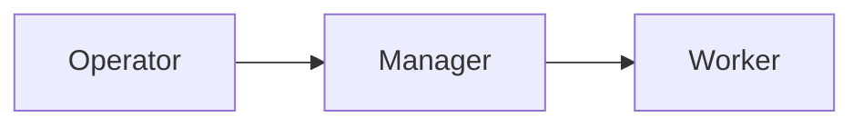

# Math and image viewing in chat

Chat Markdown renders inline LaTeX with `\( … \)` or `$ … $`, and display
equations with `\[ … \]` or `$$ … $$`. This applies to both providers and
existing loaded history, without rewriting the journal. Inline backticks and ordinary fenced code
remain literal; explicit `math` and `latex` fences render display equations once closed.
Ordinary prices such as `$5 and $10` are not equations.
Invalid/unsupported formulas remain readable as source instead of breaking the reply.

KaTeX is pinned and bundled locally; its MathML passes through the existing
DOMPurify prose sanitizer. No CDN, remote image, font fetch, trusted HTML commands,
or shared macro definitions are enabled. Rendering is capped at 128 expressions per
message, 8,192 characters per expression, 100 macro expansions, and 10em user sizes.
Delimiter searches share a 256 KiB scan budget so unfinished streaming expressions
cannot cause quadratic rescans of the whole message; excess content stays literal.
The completed-formula cache is bounded to 128 entries / 512 KiB; ordinary non-math
messages keep the original parser path. Copying a rendered equation preserves TeX.

Click an image attachment (user upload or agent publication) to open a modal filling
the application content window. This does not enter OS fullscreen. Left/Right arrows
and the Previous/Next buttons cycle through the current conversation's **loaded**
images in transcript order, wrapping at either end. Other chats and file downloads
are excluded. Older, unloaded history is not fetched merely to build a gallery.

Escape or Close exits the viewer and restores focus without moving the transcript.
Escape's keydown, held repeats and keyup are consumed so one press cannot also
dismiss an underlying dialog or trigger another chat action. Native modal focus
keeps background controls inert. Navigation keys stop at the viewer. Closing/unmounting
cleans up listeners; switching away from the app and back preserves keyboard handling.
Download and explicit failed-image retry remain available.

Verification: `markdownMath.test.ts`, `markdown.test.ts`, `ImageViewer.test.ts`,
`chatArtifacts.test.ts`, `attachmentReload.test.ts`, `transcriptCopy.test.ts`.
The browser fixture uses actual chat components without a live hub or vendor.

## Mermaid and other inline formats

Top-level fenced `mermaid` blocks render diagrams inline for either provider and existing loaded
history. Flowcharts, sequence/class/state/ER diagrams, timelines, Gantt charts and the bundled
Mermaid diagram types share this path. For example:

````markdown

````

View source retains the exact definition and the ordinary code-copy button. Unfinished streaming
fences wait for a closing fence; invalid, unavailable or oversized previews show a readable error,
source and retry. Nested fences inside lists/quotes retain the existing literal-code treatment.
Tables, task lists, strikethrough, syntax-highlighted code, math, and published image/file attachments
are also supported. Arbitrary HTML/remote image embeds, executable notebooks, external diagram
services and CAD viewers are deliberately not enabled by this feature.

Mermaid 12.0.0 is pinned and bundled locally as a separate 5.58 MB asset, requested only for a visible
diagram. It is not parsed/executed at ordinary chat startup. Rendering is debounced and serialized,
with a 20,000-character source ceiling, 200-edge Mermaid limit, one-million-character SVG ceiling,
10-second responsiveness deadline, and 16-entry / 4 MiB completed-image cache. Offscreen/unmounted
pending work is cancelled; completed offscreen diagrams keep their height to preserve scroll position.
The deadline removes a responsive/hung asynchronous frame; it is not a hard CPU preemption guarantee.

The renderer runs in a temporary opaque-origin iframe with only `allow-scripts`. CSP admits only the
nonce-bearing local bundle/bootstrap and inline styles, denying connections, images, fonts, child
frames, objects, base URLs and form submissions. Model source is sent as data, never interpolated
into the frame HTML. Only responses from that exact frame/channel are accepted. Generated SVG is
sanitized and displayed as an inert image, never inserted into the application DOM. Diagram links,
callbacks, external assets, configuration directives/frontmatter and HTML labels are disabled.
This follows [Mermaid's documented strict rendering model](https://mermaid.js.org/config/usage.html)
with an additional application-owned sandbox and image boundary.

Additional verification: `mermaidRenderer.test.ts`, `MermaidBlock.test.ts` and Markdown fence tests.
The isolated browser fixture verifies real flowchart/sequence rendering and the configuration-error
surface; automated tests cover source controls, cancellation, offscreen stability, origin/channel
spoofing, SVG sanitization and timeout cleanup.
